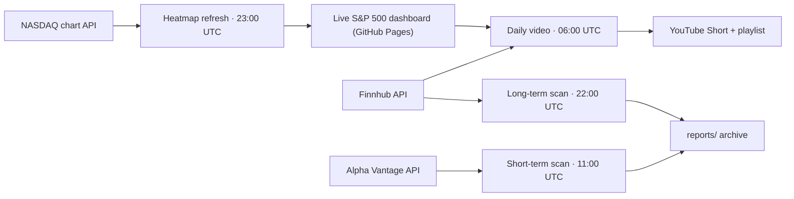

<p align="center">
  
</p>


**Self-running S&P 500 intelligence — scanners, a live heatmap, and an auto-published daily YouTube Short. Total running cost: $0/month.**

*Named after the candlestick — the **vela** — that every chart it watches is made of.*

<p align="center">
  <a href="LICENSE"></a>
  <a href="https://github.com/myendmess/Vela/actions/workflows/mapping.yml"></a>
  <a href="https://github.com/myendmess/Vela/actions/workflows/scan-longterm.yml"></a>
  <a href="https://github.com/myendmess/Vela/actions/workflows/scan-shortterm.yml"></a>
  <a href="https://github.com/myendmess/Vela/actions/workflows/daily-video.yml"></a>
</p>

<p align="center">
  <a href="https://myendmess.github.io/Vela/mapping/dashboard/"></a>
  <a href="https://www.youtube.com/playlist?list=PLL21YW0NJPng"></a>
  
</p>

<p align="center">
  <a href="https://myendmess.github.io/Vela/mapping/dashboard/"><b>Live Dashboard</b></a> ·
  <a href="https://www.youtube.com/playlist?list=PLL21YW0NJPng"><b>Daily Shorts Playlist</b></a> ·
  <a href="reports/"><b>Reports Archive</b></a> ·
  <a href="mapping/README.md"><b>Heatmap Docs</b></a> ·
  <a href="video/README.md"><b>Video Pipeline Docs</b></a>
</p>

---

## What is this?

Three independent GitHub Actions pipelines that watch the market every trading day
with **zero servers and zero paid services** — free-tier APIs in, published artifacts out:



| Pipeline | Schedule (UTC) | Source | Output |
|---|---|---|---|
| [Long-Term Scan](.github/workflows/scan-longterm.yml) | `0 22 * * 1-5` | Finnhub | ETF & index positioning report → [`reports/longterm/`](reports/longterm/) |
| [Short-Term Watchlist](.github/workflows/scan-shortterm.yml) | `0 11 * * 1-5` | Alpha Vantage | Penny/small-cap momentum watchlist → [`reports/shortterm/`](reports/shortterm/) |
| [Heatmap Data](.github/workflows/mapping.yml) | `0 23 * * *` | NASDAQ charts | [Live finviz-style S&P 500 treemap](https://myendmess.github.io/Vela/mapping/dashboard/) |
| [Daily Recap Video](.github/workflows/daily-video.yml) | `0 6 * * 2-6` | Heatmap data + Finnhub news | Auto-rendered & published [YouTube Short](https://www.youtube.com/playlist?list=PLL21YW0NJPng) |

**The daily Short is fully autonomous:** it reads the previous close from the repo's own
data, picks the day's top movers, finds fresh *relevant* headlines (quality-ranked,
deduplicated, never repeated across videos), renders a vertical video via Shotstack,
uploads it to YouTube with SEO metadata, and files it into a playlist. Failures
auto-open a GitHub Issue. Details in [`video/README.md`](video/README.md).

## Repository layout

```
├── .github/workflows/   # the four scheduled pipelines
├── scripts/             # Python scanners (Finnhub / Alpha Vantage, strictly isolated)
├── reports/             # dated Markdown archive, committed by the scanners
├── mapping/             # S&P 500 heatmap: data builder + static ECharts dashboard
└── video/               # daily YouTube Short: payload builder + renderer/uploader (zero npm deps)
```

## Run it yourself

1. Fork, then add **Actions secrets** (*Settings → Secrets and variables → Actions*):
   `FINNHUB_API_KEY`, `ALPHAVANTAGE_API_KEY` — scanners & news;
   `SHOTSTACK_API_KEY`, `YT_CLIENT_ID`, `YT_CLIENT_SECRET`, `YT_REFRESH_TOKEN` — video pipeline
   (step-by-step in [`video/README.md`](video/README.md)).
2. Enable workflow write permission (*Settings → Actions → General → Read and write*).
3. Enable GitHub Pages (*Deploy from branch → `main` / root*) for the dashboard.

Missing secrets never break a run — each pipeline degrades gracefully or skips green.

## Honest limits

Free tiers only, by design: end-of-day data (not real-time), Shotstack stage renders
carry a watermark, and anything requiring paid market data (short interest, order
flow, dark pool) is explicitly skipped rather than faked.

## Disclaimer

Everything this repository produces — reports, dashboard, videos — is a **mechanical
heuristic screen for educational purposes, not financial advice**. Do your own research.

## License

[MIT](LICENSE) © [myendmess](https://github.com/myendmess)
